# Структура проекта на Golang

*Пакеты* - В go пакет (package) - это коллекция связанных между собой функций, типов, констант и перемнных, которые могут быть использованы в других программах.

---

## Плохой пакет


---

## Хороший пакет


---

## Плохая структура


### Папка API
- REST
- POST-Like
- GRPC


---

### Папка CMD
Содержит: 
- main файлы приложений 
- конфиги
- internal приложения

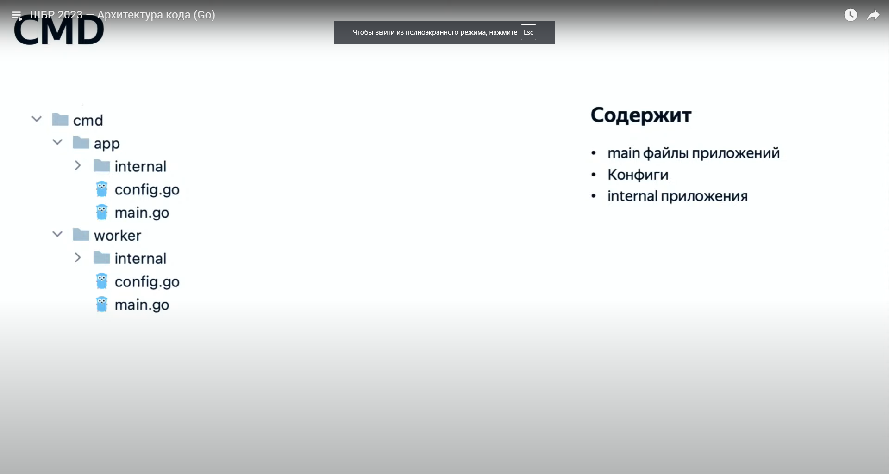

#### Папка CMD/INTERNAL
Содержит:
- Внутренние пакеты отдельного приложения

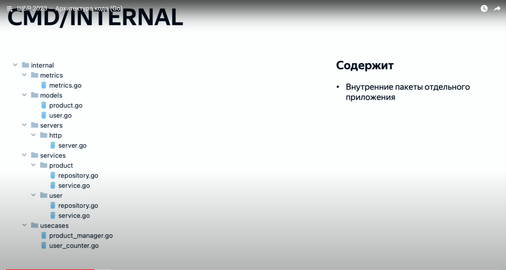

#### Папка CONFIGS
Содержит: 
- Дефолтные конфигурации сервера

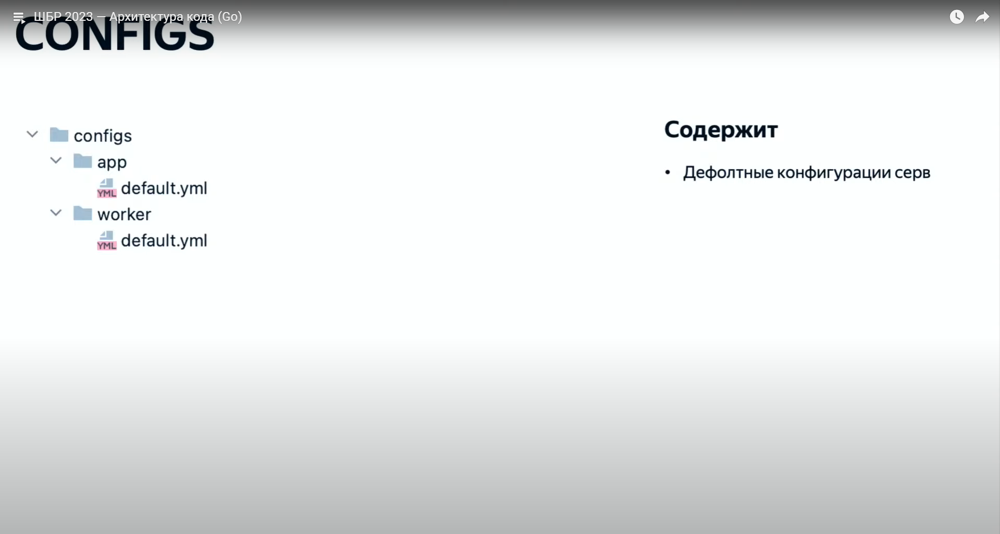

#### Папка DEPLOYMENTS
Содержит: 
- Конфигурации для локального деплоя и разработки
- Docker, Docker Compose
- CI\CD

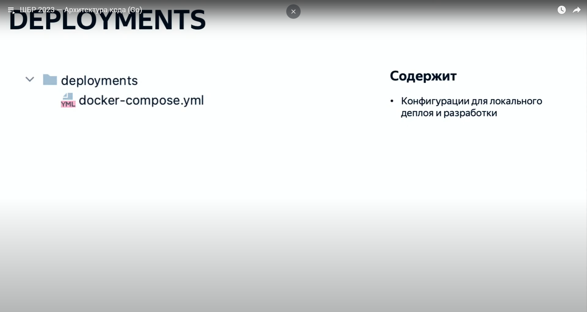

#### Папка DOCS
Содержит: 
- Документацию по проекту
- Документацию по API
- Документацию по CI

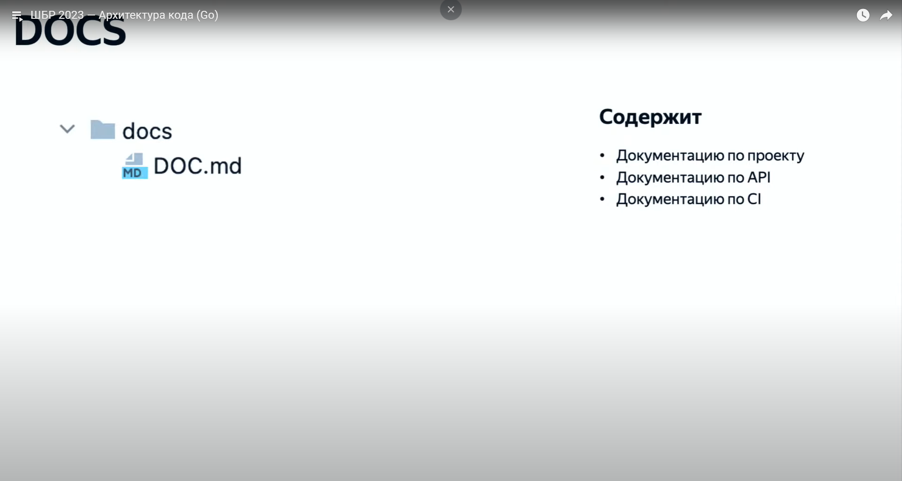

---

### Папка INTERNAL
Содержит:
- Внутрениие пакеты утилит и сервисов
- Метрики
- Кэши
- Пакет для работы с JWT и т.д.

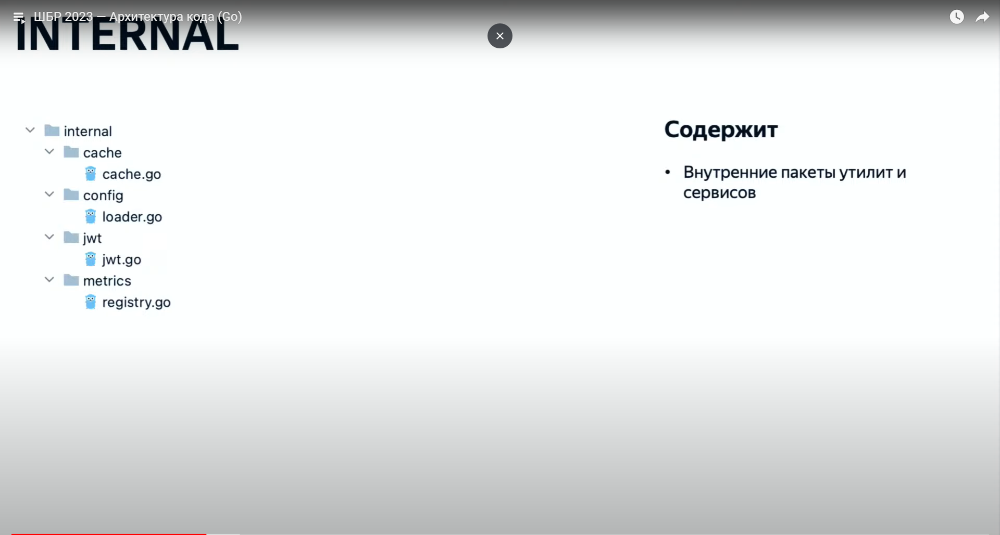

---

### Папка PKG
Содержит:
- Пакеты, которые могут импортироваться другими проектами

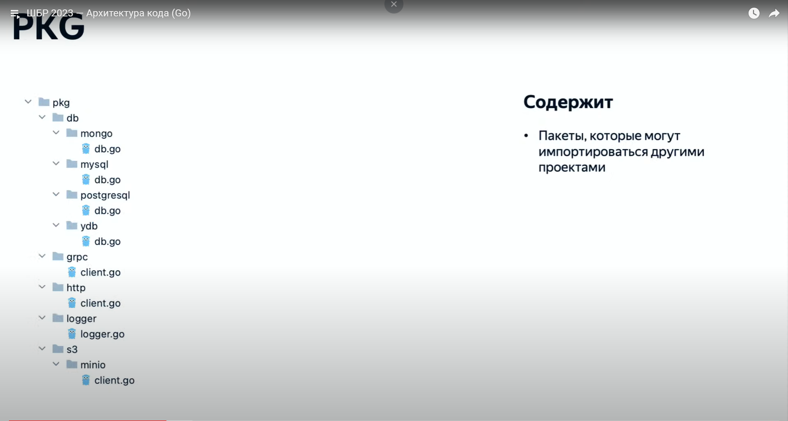

---

### Папка MIGRATIONS
Содержит:
- Скрипты миграций для баз данных

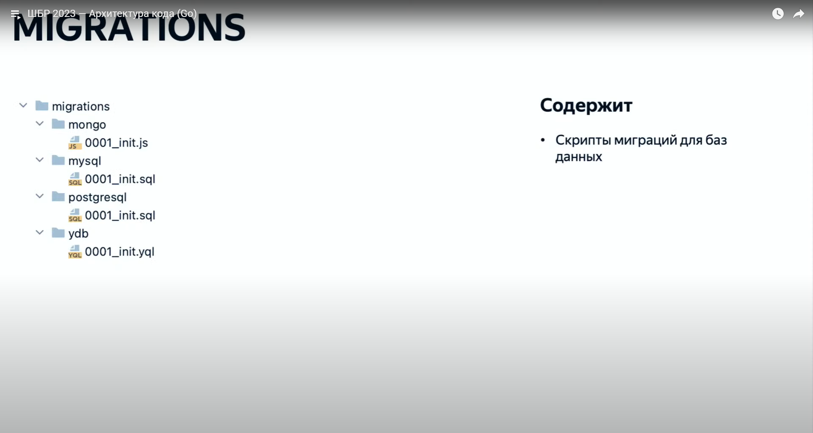

---

### Папка TEST
Содержит:
- Интеграционные тесты
- E2E тесты
- Spanshot тесты

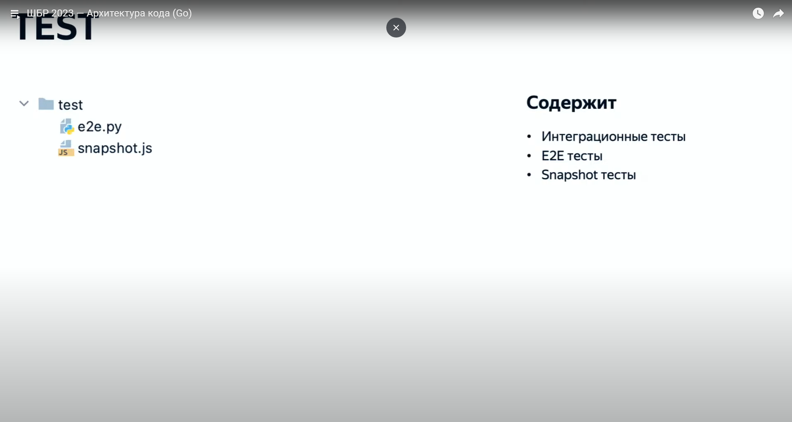

---

### OTHER
Содержит:
- go.mod и go.sum
- MAKEfile (TaskFile)
- README
- License

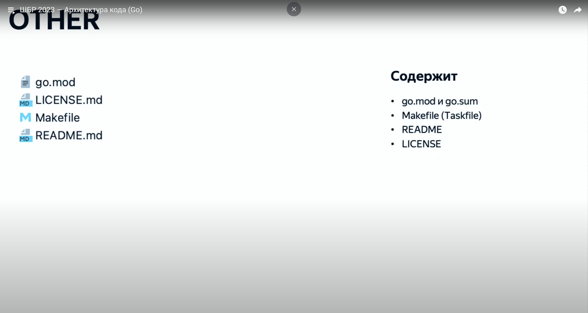


## Конфигурация проекта
_Конфигурация_ _проекта_ является одной из важнейших частей архитектры. Если проект легко натсраивать и конфигурировать, то это существенно влияет на скорость разработки и гибкость, расширяемость, тестируемость кода.

---

## Dependency Injection (DI)
_Dependency Injection (DI)_ - это паттерн проектирования, который позволяет управлять зависимостями между объектами в приложении. Он заклячается в том, что объекты не создают свои зависимости самостоятельно, а получают из извне.

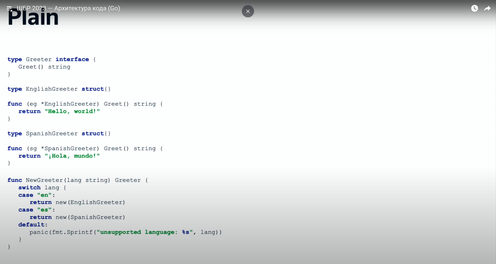


# Паттерн Репозиторий
_Репозиторий_ (Repository) - это популярный подход к организации доступа к данным в приложении. Он позволяет абстрагироваться от деталей хранения данных и предоставляет единый интерфейс для работа с данными.

```golang
    // repository.go
   type User struct {
        ID       int
        Name     string
        Email    string
        Password string
    }

    type UserInterface interface {
        GetByID(id int) (*User, error)
        GetAll() ([]*User, error)
        Create(user *User) error
        Update(user *User) error
        Delete(id int) error
    }
```

```golang 
// in_memory.go

type InMemoryUserRepository struct {
	users []*User
}

func (r *InMemoryUserRepository) GetByID(id int) (*User, error) {
	for _, user := range r.users {
		if user.ID == id {
			return user, nil
		}
	}
	return nil, errors.New("users not found")
}

func (r *InMemoryUserRepository) GetAll() ([]*User, error) {
	return r.users, nil
}

func (r *InMemoryUserRepository) Create(user *User) error {
	user.ID = len(r.users) + 1
	r.users = append(r.users, user)
	return nil
}

func (r *InMemoryUserRepository) Update(user *User) error {
	for i, u := range r.users {
		if u.ID == user.ID {
			r.users[i] = user
			return nil
		}
	}
	return errors.New("user not found")
}

func (r *InMemoryUserRepository) Delete(id int) error {
	for i, user := range r.users {
		if user.ID == id {
			r.users = append(r.users[:i], r.users[i+1:]...)
			return nil
		}
	}
	return errors.New("user not found")
}
```

```golang 
    // main.go
    func main() {
	repo := &InMemoryUserRepository{}
	user := &User{
		Name:     "John",
		Email:    "john@example.com",
		Password: "secret",
	}
	repo.Create(user)
	fmt.Println(repo.GetAll())
	user.Name = "Jane"
	repo.Update(user)
	fmt.Println(repo.GetAll())
	repo.Delete(user.ID)
	fmt.Println(repo.GetAll())
}
```