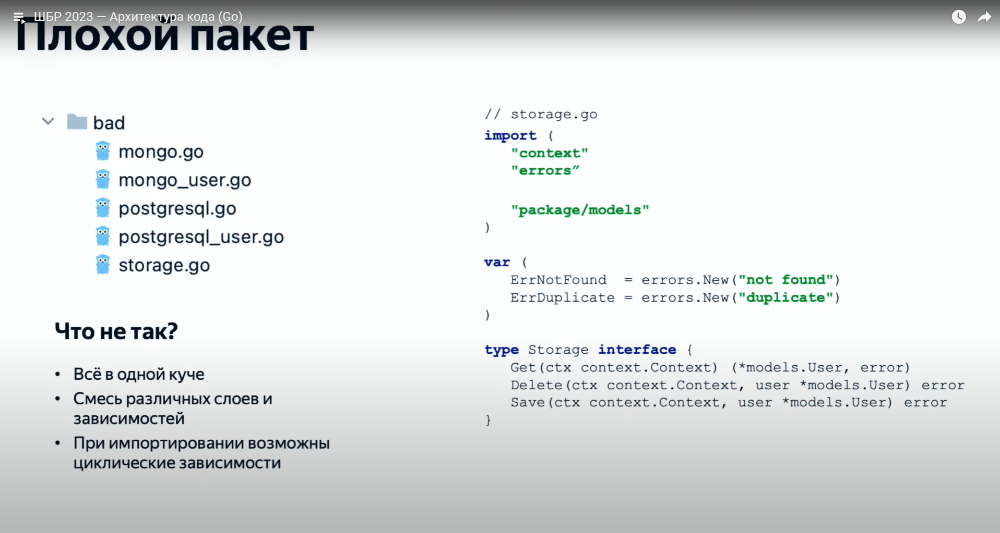
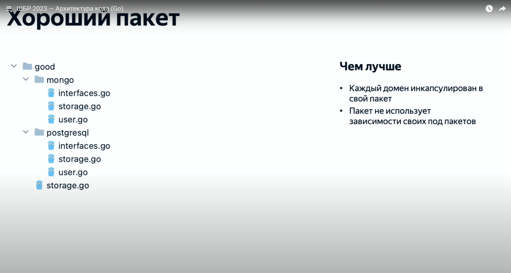
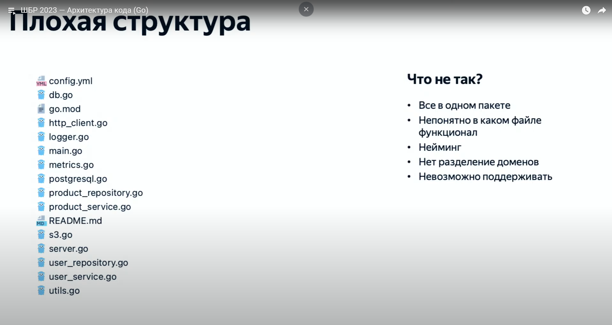
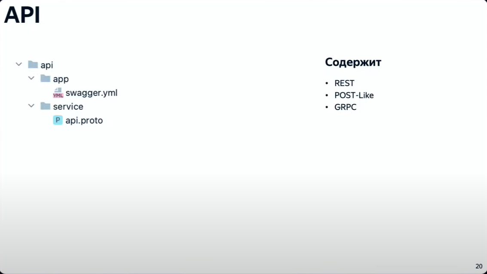

# Структура проекта на Golang

*Пакеты* - В go пакет (package) - это коллекция связанных между собой функций, типов, констант и перемнных, которые могут быть использованы в других программах.

---

## Плохой пакет

---

## Хороший пакет

---

## Плохая структура

### Папка API
- REST
- POST-Like
- GRPC

---

### Папка CMD
Содержит: 
- main файлы приложений 
- конфиги
- internal приложения

---