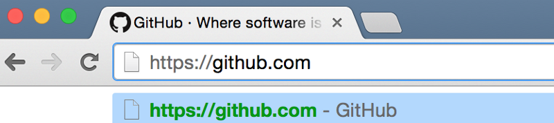
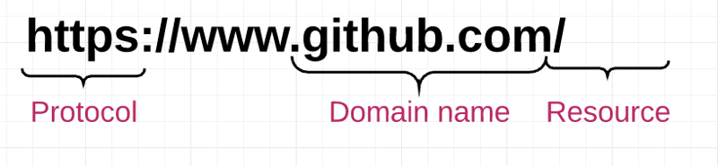
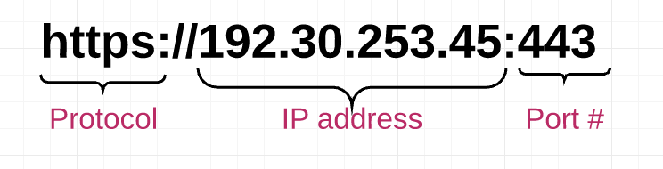
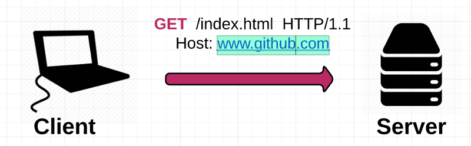

Если вы только начинаете заниматься веб—разработкой, скорее всего, вы думаете, что знаете, как работает Интернет - по крайней мере, на базовом уровне.

...Но затем вы пытаетесь объяснить, как работает базовый веб-сайт, и получаете пробел. Еще раз, что означает IP-адрес? Как именно работает модель “клиент-сервер”?

В наши дни фреймворки разработки очень сильны. На самом деле, настолько мощный, что нам, новичкам, легко потерять представление об основах того, как работает Интернет.*

Я знаю, что сделал это. Не стыдно признаться в этом: веб сложен, и только когда вы начинаете разрабатывать серверную часть, вы понимаете, насколько важны эти основы. (В любом случае, если вы хотите создавать веб-приложения, которые действительно работают.)

Поэтому я взял на себя смелость написать руководство из четырех частей по пугающим основам, с которыми должен иметь дело каждый, независимо от того, начинаете ли вы карьеру в сфере веб-разработки или просто заинтересованы в обучении:
Определение частей сети
Разбираться в Интернете пугающе, потому что там много жаргона. К сожалению, часть этого жаргона имеет решающее значение для понимания остальной части этого поста.

Вот наиболее важные термины, которые необходимо понять, если вы хотите проникнуть в секреты Всемирной паутины:

Клиент: приложение, такое как Chrome или Firefox, которое запускается на компьютере и подключено к Интернету. Его основная роль заключается в том, чтобы принимать взаимодействия пользователя и преобразовывать их в запросы к другому компьютеру, называемому веб-сервером. Хотя обычно мы используем браузер для доступа в Интернет, вы можете рассматривать весь свой компьютер как “клиентскую” часть модели клиент-сервер. Каждый клиентский компьютер имеет уникальный адрес, называемый IP-адресом, который другие компьютеры могут использовать для его идентификации.

Сервер: компьютер, подключенный к Интернету и также имеющий IP-адрес. Сервер ожидает запросов от других компьютеров (например, от клиента) и отвечает на них. В отличие от вашего компьютера (т.е. клиента), который также имеет IP-адрес, на сервере установлено и запущено специальное серверное программное обеспечение, которое сообщает ему, как отвечать на входящие запросы из вашего браузера. Основной функцией веб-сервера является хранение, обработка и доставка веб-страниц клиентам. Существует много типов серверов, включая веб-серверы, серверы баз данных, файловые серверы, серверы приложений и многое другое. (В этом посте мы говорим о веб-серверах.)

IP-адрес: Адрес интернет-протокола. Числовой идентификатор устройства (компьютера, сервера, принтера, маршрутизатора и т.д.) в сети TCP/IP. У каждого компьютера в Интернете есть IP-адрес, который он использует для идентификации и связи с другими компьютерами. IP-адреса состоят из четырех наборов чисел, разделенных десятичными знаками (например, 244.155.65.2). Это называется “логическим адресом”. Чтобы определить местоположение устройства в сети, логический IP-адрес преобразуется в физический программным обеспечением протокола TCP/IP. Этот физический адрес (т.е. MAC-адрес) встроен в ваше оборудование.

Интернет-провайдер: Интернет-провайдер услуг. Интернет-провайдер является посредником между клиентом и серверами. Для типичного домовладельца интернет-провайдером обычно является “кабельная компания”. Когда ваш браузер получит от вас запрос на переход к www.github.com , он не знает, где искать www.github.com . Таким образом, задача провайдера - выполнить поиск по DNS (системе доменных имен), чтобы узнать, на какой IP-адрес настроен сайт, который вы пытаетесь посетить.

DNS: Система доменных имен. Распределенная база данных, которая отслеживает доменные имена компьютеров и соответствующие им IP-адреса в Интернете. Пока не беспокойтесь о том, как работает “распределенная база данных”: просто знайте, что DNS существует, чтобы пользователи могли входить www.github.com вместо IP-адреса.

Доменное имя: Используется для идентификации одного или нескольких IP-адресов. Пользователи используют доменное имя (например, www.github.com ), чтобы попасть на веб-сайт в Интернете. Когда вы вводите доменное имя в свой браузер, DNS использует его для поиска соответствующего IP-адреса для данного веб-сайта.

TCP/IP: Протокол управления передачей/Интернет-протокол. Наиболее широко используемый протокол связи. “Протокол” - это просто стандартный набор правил для выполнения чего-либо. Протокол TCP/IP используется в качестве стандарта для передачи данных по сетям.

Номер порта: 16-разрядное целое число, которое идентифицирует конкретный порт на сервере и всегда связано с IP-адресом. Это служит способом идентификации конкретного процесса на сервере, на который могут быть перенаправлены сетевые запросы.

Хост: компьютер, подключенный к сети — это может быть клиент, сервер или устройство любого другого типа. Каждый хост имеет уникальный IP-адрес. Для такого веб-сайта, как www.google.com , хостом может быть веб-сервер, который обслуживает страницы веб-сайта. Часто возникает некоторая путаница между хостом и сервером, но обратите внимание, что это две разные вещи. Серверы — это тип хоста - это конкретная машина. С другой стороны, хостинг может относиться ко всей организации, которая предоставляет услуги хостинга для обслуживания нескольких веб-серверов. В этом смысле вы можете запускать сервер с хоста.

HTTP: Протокол передачи гипертекста. Протокол, который веб-браузеры и веб-серверы используют для связи друг с другом через Интернет.

URL: Единые указатели ресурсов. URL-адреса идентифицируют конкретный веб-ресурс. Простым примером является https://github.com/someone . URL-адрес указывает протокол (“https”), имя хоста (github.com ) и имя файла (страница чьего-либо профиля). Пользователь может получить веб-ресурс, идентифицированный по этому URL-адресу, по протоколу HTTP с сетевого хоста, доменное имя которого является github.com . (много скороговорки?!)

Путь от кода к веб-странице
Хорошо, теперь, когда мы разобрались с основными определениями, давайте пройдемся по поиску на Github, чтобы увидеть, как мы переходим от URL, введенного в адресную строку, к запущенной веб-странице:

1) Вы вводите URL-адрес в свой браузер

2) Браузер анализирует информацию, содержащуюся в URL-адресе. Это включает в себя протокол (“https”), доменное имя (“github.com ”) и ресурс (“/”). В этом случае после “.com” нет ничего, указывающего на конкретный ресурс, поэтому браузер знает, что нужно получить только главную (индексную) страницу

3) Браузер связывается с вашим провайдером, чтобы выполнить поиск в DNS IP-адреса веб-сервера, на котором размещен www.github.com . Служба DNS сначала свяжется с корневым сервером имен, который просматривает https://www.github.com и отвечает IP-адресом сервера имен для домена верхнего уровня “.com”. Этот адрес отправляется обратно в вашу службу DNS. Служба DNS выполняет еще один запрос к серверу имен “.com” и запрашивает у него адрес https://www.github.com .

источник: https://technet.microsoft.com/en-us/library/bb962069.aspx

4) Как только интернет-провайдер получает IP-адрес конечного сервера, он отправляет его в ваш веб-браузер

5) Ваш браузер берет IP-адрес и указанный номер порта из URL-адреса (по умолчанию для протокола HTTP используется порт 80, а для протокола HTTPS - порт 443) и открывает соединение по сокету TCP. На этом этапе ваш веб-браузер и веб-сервер наконец подключены.

6) Ваш веб-браузер отправляет HTTP-запрос на веб-сервер для главной HTML-веб-страницы вашего www.github.com .

ПОЛУЧИТЬ запрос от клиента
7) Веб-сервер получает запрос и ищет эту HTML-страницу. Если страница существует, веб-сервер подготавливает ответ и отправляет его обратно в ваш браузер. Если сервер не может найти запрошенную страницу, он отправит сообщение об ошибке HTTP 404, которое расшифровывается как “Страница не найдена”.

Ответ сервера
8) Ваш веб-браузер берет полученную HTML-страницу, а затем просматривает ее, выполняя полное сканирование с головы до ног в поисках других ресурсов, которые указаны в списке, таких как изображения, CSS-файлы, файлы JavaScript и т.д.

index.html страница
9) Для каждого перечисленного ресурса браузер повторяет весь описанный выше процесс, отправляя дополнительные HTTP-запросы к серверу для каждого ресурса.

10) Как только браузер завершит загрузку всех остальных ресурсов, которые были перечислены на HTML-странице, страница, наконец, будет загружена в окне браузера, и соединение будет закрыто

Github
Пересекая интернет-бездну
Одна вещь, на которую стоит обратить внимание, - это то, как передается информация, когда вы делаете запрос о предоставлении информации. Когда вы отправляете запрос, эта информация разбивается на множество крошечных фрагментов, называемых пакетами. Каждый пакет помечен заголовком TCP, который включает номера портов источника и назначения, и заголовком IP, который включает IP-адреса источника и назначения, чтобы придать ему идентичность. Затем пакет передается через Ethernet, Wi-Fi или сотовую сеть, и ему разрешается перемещаться по любому маршруту и совершать столько переходов, сколько ему необходимо, чтобы добраться до конечного пункта назначения.

(На самом деле нам все равно, как туда попадают пакеты — важно только, чтобы они добрались до места назначения в целости и сохранности!) Как только пакеты достигают места назначения, они снова собираются и доставляются как единое целое.

Итак, как все пакеты узнают, как добраться до места назначения, не заблудившись?

Ответ - TCP/IP.

TCP/IP - это система, состоящая из двух частей, функционирующая как фундаментальная “система управления” Интернетом. IP расшифровывается как Internet Protocol; его задача заключается в отправке и маршрутизации пакетов на другие компьютеры, используя IP-заголовки (т.е. IP-адреса) в каждом пакете. Вторая часть, протокол управления передачей (TCP), отвечает за разбиение сообщения или файла на более мелкие пакеты, маршрутизацию пакетов к нужному приложению на целевом компьютере с использованием заголовков TCP, повторную отправку пакетов, если они потерялись в пути, и повторную сборку пакетов в правильном порядке после их получения. добрался до другого конца.

Рисуем окончательную картину
Но подождите — работа еще не закончена! Теперь, когда в вашем браузере есть ресурсы, составляющие веб-сайт (HTML, CSS, JavaScript, изображения и т.д.), он должен выполнить несколько шагов, чтобы представить вам ресурсы в виде удобочитаемой веб-страницы.

В вашем браузере есть механизм рендеринга, который отвечает за отображение контента. Механизм рендеринга получает содержимое ресурсов небольшими порциями. Затем существует алгоритм синтаксического анализа HTML, который сообщает браузеру, как анализировать ресурсы.

После анализа он генерирует древовидную структуру элементов DOM. DOM расшифровывается как объектная модель документа, и это соглашение о том, как представлять объекты, расположенные в HTML-документе. Этими объектами — или “узлами” — каждого документа можно манипулировать с помощью языков сценариев, таких как JavaScript.

0*EHTSP-ftWos_vpxp
Дерево DOM
Как только дерево DOM построено, таблицы стилей анализируются, чтобы понять, как стилизовать каждый узел. Используя эту информацию, браузер перемещается по узлам DOM и вычисляет стиль CSS, положение, координаты и т.д. для каждого узла.

Как только браузер получит узлы DOM и их стили, он *наконец* будет готов соответствующим образом отобразить страницу на вашем экране. Результат: все, что вы когда-либо просматривали в Интернете.

Сеть сложна, но вы только что закончили самую сложную часть
Итак, вот и вся паутина в двух словах. Потерялся? Мы все такие, но если вы дочитали до этого места, то уже закончили самую трудную часть. Очевидно, я пропустил некоторые детали в интересах того, чтобы показать вам здесь общую картину; но если вы сможете осмыслить основную последовательность событий, описанную выше, то заполнить детали будет проще простого.

Ознакомьтесь с частью 2, где мы рассмотрим структуру базового веб-приложения. :)